<!-- MDTOC maxdepth:6 firsth1:1 numbering:0 flatten:0 bullets:1 updateOnSave:1 -->

- [GDD - Artemis Inferno](#gdd-artemis-inferno)   
   - [Requisitos do projeto](#requisitos-do-projeto)   
   - [Plataforma](#plataforma)   
   - [Gênero](#gênero)   
   - [Plot](#plot)   
   - [Conceitos](#conceitos)   
      - [O ano: 2069](#o-ano-2069)   
      - [Espaçonave Artemis 11](#espaçonave-artemis-11)   
      - [Gaia](#gaia)   
   - [Tema](#tema)   
   - [Objetivo principal](#objetivo-principal)   
   - [Experiência](#experiência)   
      - [Dinâmica básica de RPG](#dinâmica-básica-de-rpg)   
   - [Sistema de Tensão](#sistema-de-tensão)   
   - [Playfield](#playfield)   
   - [Avatar](#avatar)   
   - [Gameplay](#gameplay)   
      - [Ações do jogador](#ações-do-jogador)   
         - [Navegar pela trilha](#navegar-pela-trilha)   
         - [Gerenciar o seu recurso vital](#gerenciar-o-seu-recurso-vital)   
         - [Evadir](#evadir)   
         - [Utilizar Power-Ups](#utilizar-power-ups)   
            - [Feixe de Energia](#feixe-de-energia)   
               - [Requisito de uso](#requisito-de-uso)   
               - [Efeito colateral](#efeito-colateral)   
            - [Escudo Defletor](#escudo-defletor)   
            - [Portal Dimensional](#portal-dimensional)   
      - [Encontros](#encontros)   
         - [Teste de proeficiência](#teste-de-proeficiência)   
         - [Inimigos ou Obstáculos](#inimigos-ou-obstáculos)   
            - [Ataque Alienígena](#ataque-alienígena)   
            - [Cinturão de Asteróides](#cinturão-de-asteróides)   
            - [Meteoríto de Ferro](#meteoríto-de-ferro)   
         - [Bônus](#bônus)   
            - [Estação Espacial](#estação-espacial)   
            - [Módulo de Serviço Espacial](#módulo-de-serviço-espacial)   
         - [Objetivos Secundários ou Quests](#objetivos-secundários-ou-quests)   
            - [Consertar Ônibus Espacial](#consertar-ônibus-espacial)   
            - [Consertar Satélite](#consertar-satélite)   
            - [Informações sobre Artemis 10](#informações-sobre-artemis-10)   
   - [HUD](#hud)   
   - [Layout](#layout)   
      - [Arte final](#arte-final)   
      - [Tipografia](#tipografia)   
   - [Level design](#level-design)   
      - [Balanceamento de dificuldade](#balanceamento-de-dificuldade)   
         - [Caminho difícil](#caminho-difícil)   
         - [Caminho fácil](#caminho-fácil)   
         - [Probabilidade de conclusão](#probabilidade-de-conclusão)   
   - [Regras para o jogador](#regras-para-o-jogador)   
      - [Artemis Inferno | Manual do comandante](#artemis-inferno-manual-do-comandante)   
         - [Reator da Artemis 11](#reator-da-artemis-11)   
         - [Ações](#ações)   
         - [Objetivos Secundários [Opcional]](#objetivos-secundários-opcional)   

<!-- /MDTOC -->

---

# GDD - Artemis Inferno
Este documento descreve todas as ideias, conceitos, elementos, regras, arte, informações técnicas, processos, além de qualquer outro tipo de informação pertinente ao desenvolvimento do mini-jogo de tabuleiro *Artemis Inferno*.

## Requisitos do projeto
Projetar um jogo simples no papel - entenda papel como a plataforma, com os seguintes requisitos:

- O jogo deverá caber em um pedaço de papel, de preferência A4.
- O jogo deverá ser para um jogador apenas.
- Uma curta descrição e instruções para o seu jogo deverá estar no topo da página.
- A única coisa extra que alguém deverá precisar para jogar, são dois dados D6 (estes são elementos opcionais).

É igualmente importante que seu jogo contenha:

- Um objetivo claro, de fácil percepção;
- Um grau de dificuldade aumentado pela sorte e/ou habilidades.

Além disso, o espaço do jogo pode possuir qualquer forma, desde que se encaixe dentro dos limites de uma folha de papel e que possua sentindo no contexto do seu jogo. Os espaços do seu tabuleiro poderá conter informações, desde que estas não exedam o espaço. Um espaço pode mudar o objetivo do seu personagem, a quantidade de dados a rolar, desbloquear uma nova parte do tabuleiro, retroceder o personagem, dentre várias outras ações que seu jogo necessite.

## Plataforma
Como descrito nos requisitos para o projeto, este deverá ser um boardgame que utilize a frente de um papel A4 como plataforma. A4 é um tamanho de papel, definido pela norma ISO 216, com as dimensões de 210mm de largura e 297mm de altura.

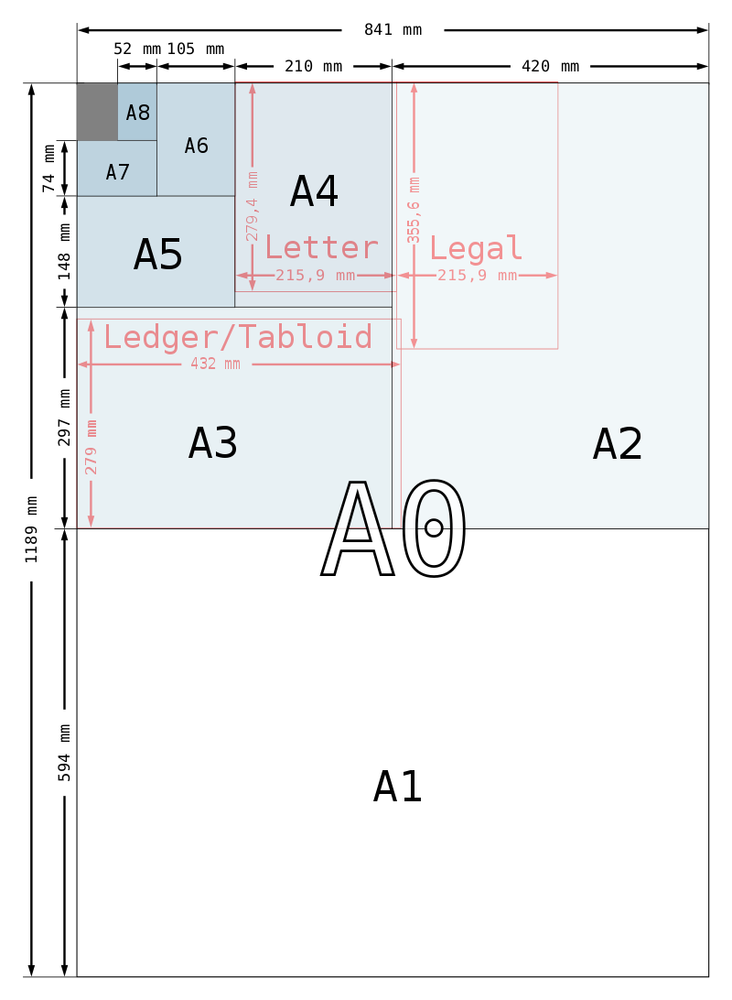

Trabalhar com requisitos e uma plataforma tão limitante foi crucial para o processo criativo e todas as decisões e soluções de design. Em seu primeiro rascunho o jogo possuia vários recursos que tiveram que ser cortados, reduzindo ao máximo o escopo para obedecer os requisitos impostos para o projeto.

## Gênero
Devido a natureza da plataforma, escolhi trilha como gênero do jogo. Porém, não é um jogo de trilha tradicional, linear; este é um jogo de trilha extremamente não-linear, uma vez que o jogador não tem controle sobre a direção do seu avatar e pode ficar indo e voltando nos espaços de maneira totalmente aleatória.

## Plot
O ano é 2069, e você é o comandante a bordo da nave Artemis 11 indo para a colônia lunar Gaia II. Seu objetivo é entregar os suprimentos vitais à sobreviência desta colônia. Sua missão é extremamente importante, pois a espaçonave Artemis 10 não conseguiu chegar ao destino e a colônia agora sofre com racionamento dos suprimentos. Você é a última esperança de sobrevivência de Gaia II. Boa sorte comandante!

## Conceitos
A narrativa deste jogo tem fortes referências históricas. São elas:

### O ano: 2069
Este é uma referência a missão da NASA, Apollo 11, a qual ocorreu em 1969 e foi responsável pelo homem pisar na Lua pela primeira vez. Em 2069 essa missão completará 100 anos.

### Espaçonave Artemis 11
Referência ao nome da missão da NASA de 1969, Apollo 11. Ártemis, na mitologia, é a irmã gêmea de Apolo, além de ser considerada também como a deusa da Lua.

### Gaia
Na mitologia, Gaia representa a mãe-terra. Dentro do contexto do jogo, a colônia lunar Gaia II representa uma nova Terra para os humanos.

## Tema
O tema definido para este jogo é a viagem espacial até uma colônia humana na lua.

## Objetivo principal
O objetivo do jogador é, partindo do planeta Terra, chegar são e salvo até a colônia lunar GAIA II e realizar a entrega de suprimentos, impedindo a morte de todos os habitantes da colônia.

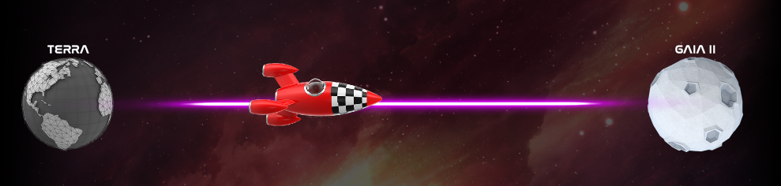

## Experiência
As experiências que o jogador deverá experimentar primariamente são duas:

- Gerenciamento de recurso
- Sobrevivência

Sendo que ambas as experiências se fundem numa só, pois o recurso que o jogador gerencia durante o jogo é exatamente o seu HP, que se findado resulta na condição de Game Over.

Estas duas experiências são reforçadas através do sitema de tensão do jogo, que força-o a todo instante a tomar decisões, sendo que para cada decisão háverá um custo crítico, seja esse de distância até chegar ao objetivo ou de HP; além de provêr também recompensas em determinados eventos ou objetivos secundários.

### Dinâmica básica de RPG
Em alguns momentos do jogo, o jogador precisará realizar um teste de proeficiência; seja este para destruir um obstáculo ou para realizar uma missão secundária. Nesses momentos o jogador experimentará uma dinâmica básica de RPG como uma sub-experiência dentro do gameplay.

## Sistema de Tensão
O sistema de tensão do jogo Artemis Inferno é baseado primáriamente nas ações possíveis que o jogador tem a cada espaço trilhado no jogo. A todo instante o jogo força o jogador a tomar decisões; seja frente a uma ameaça iminente, um objetivo secundário e/ou a probabilidade de direções que randomicamente irão surgir.

Todas as ações do jogador tem vantagens e desvantagens; porém devido ao balanceamento de risco-recompensa aliado a característica de sorte do jogo, em alguns momentos poderão ocorrer inversões, transformando uma desvantagem em vantagem e vice-versa.

Nada é o que parece ser a primeira vista em Artemis Inferno.

## Playfield
Como o espaço para projetar o jogo é extremamente limitado, escolhi o formato hexagonal para determinar cada espaço da trilha. Esta decisão foi uma resposta a seguinte pergunta:

- **Como projetar um playfield em um espaço tão limitado e que permita um maior número possível de movimentações?**

Como resposta durante a prototipação, cheguei ao formato hexagonal, permitindo ao jogador percorrer até seis diferentes posições na trilha do jogo. Otimizando assim a quantidade de movimentações em um espaço pequeno.

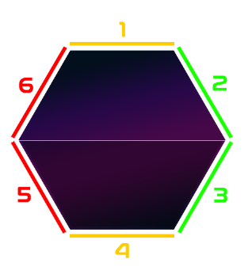

## Avatar
O jogador encarna o papel de um comandante a bordo de uma espaçonave, porém o game token durante o gameplay é uma nave e não o comandante em si. Para transmitir a sensação de escolha ao jogador, o jogo provê três tipos diferentes de espaçonaves para servir como avatar no gameplay.

O jogador deverá recortar a sua Artemis 11 preferida para poder jogar.

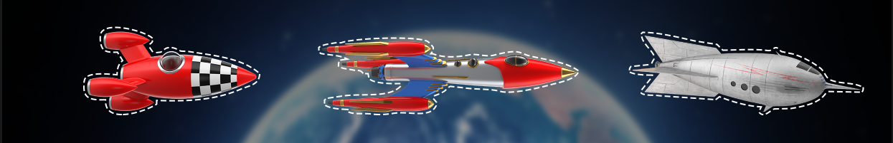

## Gameplay
O gameplay é bastante simples. O jogador deverá, partindo da Terra, chegar até a colônia lunar Gaia II. Porém a dinâmica primária do jogo é baseada na relação sorte/probabilidade - habilidade. O foco do gameplay é o extremo desafio, pois o jogador não terá controle da direção percorrida por sua espaçonave - salvo algumas exceções de recompensa, isso é um resultado totalmente randômico; então tomar decisões bem planejadas sobre quais ações realizar em cada tipo de situação imposta pelo jogo é a habilidade que fará a diferença entre ganhar ou perder o jogo.

Para jogar Artemis Inferno, o jogador precisará de dois dados D6. Um dado é utilizado como game token para marcar a quantidade de HP do avatar, enquanto o outro é utilizado para definir as direções de navegação do avatar em relação a trilha do jogo.


### Ações do jogador
O jogador só poderá realizar uma ação por jogada, ou seja, a cada vez que rolar o dado para definir uma direção e após navegar para o novo espaço, o jogador terá que escolher um das seguintes ações disponíveis:

- Navegar pela trilha
- Gerenciar o seu recurso vital
- Evadir
- Utilizar Power-Ups

#### Navegar pela trilha
Cada espaço da trilha poderá permitir que o jogador navegue em até seis direções diferentes devido a sua forma hexagonal. Para navegar, o jogador precisará determinar a coordenada de direção, para isso ele deverá rolar um dado. O valor deste determina a direção a seguir na trilha, no qual o jogador deverá avançar um espaço por jogada.

Cada espaço hexagonal da trilha é dividido em três seções de acordo com o movimento, e estes são classificados pelas cores:

- **Vermelho:** direção negativa ou de retorno
- **Amarelo:** direção neutra
- **Verde:** direção positiva ou de avanço


Além disso uma espaço poderá não conter todas as direções, nesse caso o jogador deverá continuar lançando o dado até obter uma coordenada de direção válida.

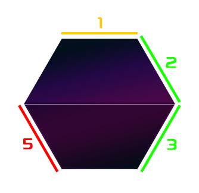

#### Gerenciar o seu recurso vital
Em Artemis Inferno o jogador tem apenas um único recurso para gerenciar, este é a quantidade de *Células de Energia* da espaçonave - ou *CE* como é referenciado no jogo. Obviamente a energia é o que permite que a espaçonave navegue através da trilha, realize objetivos secundários e mantenha o jogador vivo; neste contexto as células de energia representam o **HP** e a **moeda** do jogador. Caso as células de energiam cheguem a zero, o jogo acaba.

Como o game token utilizado para marcar a quantidade de CE é um D6, obviamente seis é o número máximo de CE que o jogador poderá manter no reator da sua espaçonave.

#### Evadir
Durante o gameplay o jogador sempre terá a sua disposição a opção de fugir de um perigo, para isso ele utiliza a ação Evadir. Esta ação não necessita de nenhum teste ou rolagem de dado; porém só poderá ser utiliza quando houver um perigo iminente. Para realizar a ação Evadir o jogador deverá retroceder um espaço em qualquer uma das duas direções vermelhas (5 e 6). Caso no espaço atual não exista nenhuma direção vermelha, o jogador então deverá retroceder em qualquer uma das duas direções amarelas (1 e 4). Se não existir nenhuma direção vermelha ou amarela, o jogador obviamente não poderá usar esta ação e é obrigado a enfrentar o perigo iminente.

O jogador não recebe nem bônus e nem dano dos espaços retrocedidos.

A ação Evadir não consome CE.

Evadir é uma ação primordial para o balancemento de dificuldade do jogo, uma vez que o jogador, na maior parte do gameplay, não tem nenhum controle sobre a direção a seguir; esta ação pode ser vital como uma tentativa do jogador de tendenciar uma direção.

#### Utilizar Power-Ups
O jogo Artemis Inferno provê ao jogador três Power-Ups, são eles:

- Feixe de Energia
- Escudo Defletor
- Portal Dimensional

O jogador só poderá utilizar Power-ups quando estiver em perigo.

> **Nota**
>
> Vale ressaltar que o jogo só permite uma ação por jogada. Ao final de cada ação o jogador deverá rolar novamente o dado para definir uma nova coordenada de direção.

##### Feixe de Energia
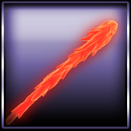

```
- Requer teste de proeficiência
- Destroi qualquer ameaça
- Knockback: 2
```

Este Power-Up é a única arma que o jogador possui a sua disposição, porém é extremamente poderosa, capaz de destruir qualquer ameaça.

Como é um Power-Up extremamente poderoso, este poderia desequilibrar o balanceamento da dificuldade do jogo, caso o jogador pudesse usá-lo indiscriminadamente. Dessa forma foi definido um requisito de uso e um efeito colateral.

###### Requisito de uso
Para utilizar o Feixe de Energia, o jogador deverá realizar um teste de proeficiência, tendo o seu valor necessário para o sucesso definido por cada tipo de inimigo ou obstáculo.

Caso não passe no teste o jogador não pode tentar outra ação e portanto recebe o dano.

###### Efeito colateral
Se o jogador obtiver sucesso, este recebe o bônus estipulado pelo evento e um efeito colateral Knockback de valor 2.

O efeito Knockback é uma mecânica do jogo que ocorre ao utilizar o Feixe de Energia. Ele representa um efeito colateral, ou melhor, uma desvantagem para equilibrar este Power-Up.

O Knockback força o jogador a retroceder sua posição em dois espaços. O jogador deverá escolher em primeiro momento direções vermelhas para retroceder; porém se não houver, deverá escolher direções amarelas. O jogador deverá sempre seguir esta ordem de precedência e poderá mesclar, contanto que o primeiro espaço seja uma direção de retorno (vermelha) e se não houver outra do mesmo tipo deverá seguir para uma direção neutra (amarela).

Caso não existam direções suficientes para retroceder o total do efeito, o jogador deverá retroceder a metade desse valor - no caso 1 espaço; se não for possível, o jogador deverá permanecer no espaço atual, não ganha bônus, porém recebe qualquer dano infligido em sua totalidade. O jogador não recebe nem bônus e nem dano nos espaços retrocedidos pelo efeito colateral Knockback.

##### Escudo Defletor

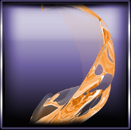

```
- Não requer teste de proeficiência
- Reduz o dano sofrido em 50%
```

Este é um típico Power-Up passivo, ele absorve 50% do dano infligido a sua nave. O Escudo Defletor é a escolha do jogador que decide não arriscar tudo num teste de proeficiência para utilizar o Feixe de Energia e deseja manter sua posição atual. Essa decisão sacrifica CE para manter a nave em um espaço que permita uma possível rota de vitória, porém não recebe o bônus.

##### Portal Dimensional

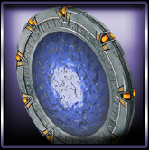

```
- Não requer teste de proeficiência
- Permite fugir do perigo atarvés de uma nova jogada
- Recebe bônus ou ataque no espaço de destino
- Não consome CE
```
O Portal Dimensional é um Power-Up de ação evasiva extremamente poderoso, pois ao contrário da ação Evadir, o jogador tem a probabilidade de *66,66%* de fugir para uma direção que não seja de retorno, podendo esta ser neutra ou de avanço.

Para utilizar este Power-Up o jogador deverá realizar uma nova rolagem de dado para determinar uma direção de fuga. Ao chegar no destino o jogador receberá o efeito do espaço, podendo ser bônus ou dano, ou seja, ao chegar no destino o jogador não poderá realizar nenhuma outra ação, ele fica passivo às consequências, e após deverá realizar uma nova jogado, continuando assim o jogo. Essa é uma desvantagem incluída no Portal Dimensional para poder equilibrá-lo e tornar o seu uso uma ação realmente pensada por parte do jogador, mantendo assim um bom balanceamento de risco e recompensa; porém como existem espaços que permitem o ganho de bônus e objetivos secundários, essa desvantagem pode se tornar uma vantagem.

Utilizar o Portal Dimensional não consome CE.

### Encontros
Durante todo o gameplay em Artemis Inferno, o jogador poderá ter três tipos de encontros randômicos:

- Inimigos ou Obstáculos
- Bônus
- Objetivo Secundário

#### Teste de proeficiência
Nos encontros com Inimigos/Obstáculos e Objetivos Secundários, o jogador deverá realizar um teste de proeficiência se quiser destruir ou superar o desafio, respectivamente.

Em cada um destes encontros o jogador receberá a informação do valor que deverá conseguir, através da rolagem do dado, para obter sucesso. Se falhar, o jogador sofrerá as consequências.

#### Inimigos ou Obstáculos
Estes são os elementos do jogo que causam dano ao jogador. Em Artemis Inferno temos três deles:

- Ataque Alienígena
- Cinturão de Asteróides
- Meteoríto de Ferro

##### Ataque Alienígena
```
- Dano: 6 CE
- Teste de proeficiência > 4
    - 33,33% chance de vitória
    - 66,67% chance de derrota
- Recompensa: 4 CE
```

O Ataque Alienígena é o mais perigoso dos encontros em Artemis Inferno, pois seu dano é o máximo de CE que o jogador pode ter, ou seja, se o jogador perder no teste de proeficiência - mesmo que esteja com 100% de CE, o dano será letal. Porém o sistema de risco-recompensa tenta o jogador a enfrentar o teste ao invés de utilizar outras ações, não só pelo bônus, mas principalmente com o desejo de manter a posição, uma vez que o Ataque Alienígena está a apenas uma provável jogada do objetivo principal do jogo.

O bônus por um teste bem sucedido é de 4 CE, o que representa aproximadamente 66,67% da CE total.

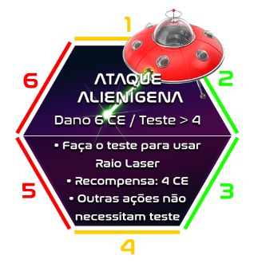

##### Cinturão de Asteróides
```
- Dano: 4 CE
- Teste de proeficiência > 3
    - 50% chance de vitória
    - 50% chance de derrota
- Recompensa: 3 CE
```

O Cinturão de Asteróides é o segundo encontro mais letal do jogo, ele inflige ao jogador um dano de 4 CE - o que representa aproximadamente 66,67% do total de CE, isso levando em conta que o jogador esteja com 100% de CE. Porém o jogador tem 50% de chance tanto de vitória como de derrota, com recompensa de 3 CE em caso de vitória.

Apesar da recompensa equivaler a 50% do total de CE do jogador, o nível de dificuldade pode fazer com que a maioria dos jogadores desistam de enfretá-lo. Por esse motivo a localização deste encontro no tabuleiro, aliado a seu nível de recompensa é o que criará o atrativo para o jogador se arriscar no teste de proeficiência. Este encontro antecede o Ataque Alienígena e está a duas prováveis jogadas do final do jogo. Neste contexto o que o jogador mais quer é manter sua posição, apostando numa jogada de sorte no dado para lhe deixar a um espaço da conclusão do objetivo principal do jogo.

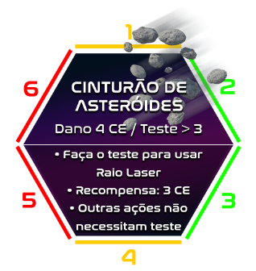

##### Meteoríto de Ferro
```
- Dano: 2 CE
- Teste de proeficiência > 2
    - 66,67% chance de vitória
    - 33,33% chance de derrota
- Recompensa: 2 CE
```

O Meteoríto de Ferro é o encontro menos letal do jogo. Ele causa 2 CE de dano - o que equivale a 33,33% do total de CE, isso levando em conta que o jogador esteja com 100% de CE. Porém como tudo em Artemis Inferno, toda e qualquer probabilidade é randômica. Dependendo da quantidade de CE que o jogador tenha, este pode se tornar um encontro tão letal quanto o Ataque Alienígena.

O Teste de proeficiência permite uma chance de 66,67% de vitória, com bônus de 2 CE. No caso deste encontro o atrativo em realizar o teste não está no bônus, mas sim na posição deste em relação ao objetivo principal do jogo; ele está a distância de um espaço, o que representa apenas uma provável jogada do dado para finalizar o jogo.

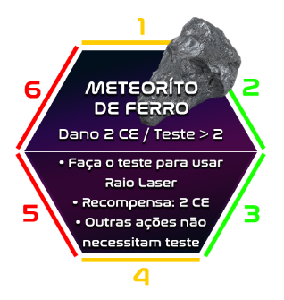

#### Bônus
Estes são os elementos do jogo que auxiliam o jogador através de vantagens gratuitas. Em Artemis Inferno temos dois deles:

- Estação Espacial
- Módulo de Serviço Espacial

##### Estação Espacial
```
- 100% recarga CE
- Escolha de direção da navegação
- Não consome CE
```

A Estação Espacial representa o melhor encontro de bônus, pois além dela recarregar 100% das Células de Energia, ela permite o jogador escolher uma direção e navegar 1 espaço sem gastar CE.

Em relação ao sistema de tensão, a Estação Espacial permite que o jogador navegue diretamente para o encontro Ataque Alienígena, que como já vimos, está a um espaço ou jogada de distância do objetivo principal. Só que este é o encontro de maior risco para o jogador. Novamente entra em cena o balanceamento de risco-recompensa.

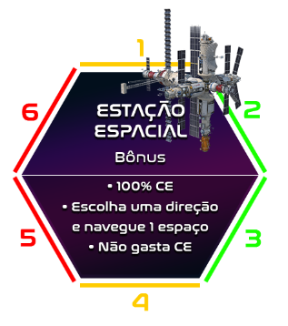

##### Módulo de Serviço Espacial
```
- 50% recarga CE
- Não consome CE
```

O Módulo de Serviço Espacial é um encontro bônus que recarrega em 50% as Células de Energia, além de permitir que o jogador se desloque na próxima jogada sem gastar CE.

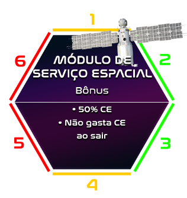

#### Objetivos Secundários ou Quests
Estes são os elementos do jogo de interação opcional, são as quests. Para participar de um objetivo secundário, o jogador deverá pagar uma determinada quantia de CE e ainda realizar o teste de proeficiência. Se passar no teste o jogador o jogador é bem recompensado, caso contrário ele reavê 50% do CE pago. Em Artemis Inferno temos três deles:

- Consertar Ônibus Espacial
- Informações sobre Artemis 10
- Consertar Satélite


##### Consertar Ônibus Espacial
```
- Pague 2 CE
- Teste de proeficiência > 3
    - 50% chance de vitória
    - 50% chance de derrota
- Recompensa: 4 CE + Escolhe direção e navegue 2 espaços sem gastar CE
```
Para participar desta quest o jogador deverá pagar 2 CE e realizar o teste de proeficiência, este com resultado maior que 3 - o que resulta em 50% de chance de vitória. Como recompensa o jogador receberá 4 CE - ou o que faltar para completar 100% (6 CE), além de ter o poder de escolher uma direção e navegar dois espaços sem gastar CE.

Consertar ônibus Espacial é a melhor quest do jogo, pois permite ao jogador direcionar seu avatar através de dois espaços de sua escolha na trilha e recarregar o nível de CE em 100%.

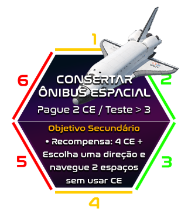

##### Consertar Satélite
```
- Pague 2 CE
- Teste de proeficiência > 2
- 66,66% chance de vitória
- 33,34% chance de derrota
- Recompensa: Escolhe direção e navegue 2 espaços sem gastar CE
```

Para participar desta quest o jogador deverá pagar 2 CE e realizar o teste de proeficiência, este com resultado maior que 2 - o que resulta em 66,66% de chance de vitória. Como recompensa o jogador escolhe uma direção e navega dois espaços sem gastar CE.

Consertar Satélite é uma quest excelente para jogadores que desejam alterar a direção do seu avatar na trilha.


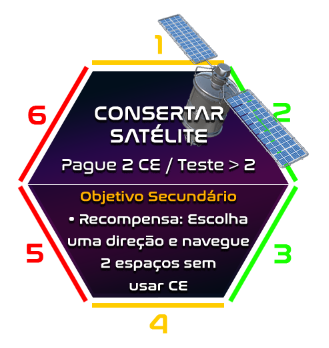

##### Informações sobre Artemis 10
```
- Pague 2 CE
- Teste de proeficiência > 1
    - 83,33% chance de vitória
    - 16,67% chance de derrota
- Recompensa: 4 CE + sai sem gastar CE
```

Para participar desta quest o jogador deverá pagar 2 CE e realizar o teste de proeficiência, este com resultado maior que 1 - o que resulta em 83,33% de chance de vitória. Como recompensa o jogador receberá 4 CE, além de sair na próxima jogada sem gastar CE.

Informações sobre Artemis 10 é uma quest excelente para jogadores que necessitam recarregar suas CE's.

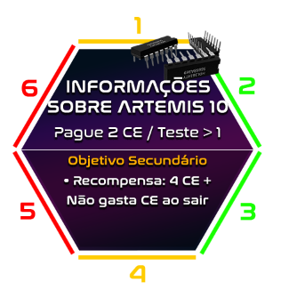


## HUD
O HUD do jogo Artemis Inferno é bastante simples, ele contém um slot para a colocação do dado que marcará a quantidade de Células de Energia durante o gameplay, além de cada um dos Power-Ups contendo suas informações básicas.


## Layout
O layout do jogo Artemis Inferno foi totalmente construído numa folha de papel A4 - padrão internacional ISO 216, com as dimensões de 210mm de largura e 297mm de altura.

Todo o layout está composto apenas em um dos lados da folha A4 - como manda os requisitos do projeto, e possui a seguinte anatomia:

- **Seleção de Avatar:** 19 x 4,23cm
- **Descrição e Manual do Jogo:** - 19 x 6,21cm
- **Playfield:** 14,61 x 17,26cm
- **HUD:** 3,26 x 17,26cm
- **Logotipo Artemis Inferno:** 1,13 x 17,26cm
- **Margens:** 1cm (x4)

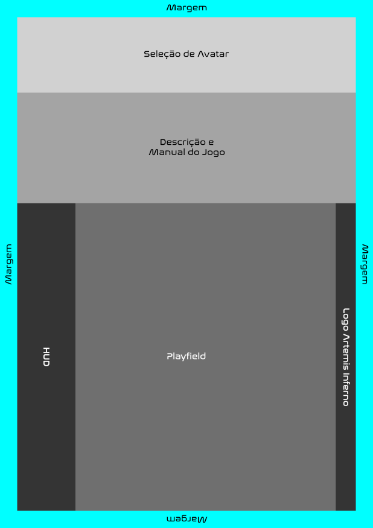

### Arte final
A proposta da arte do jogo deve transmitir um tom futurista, porém com um toque do estilo "futurista retrô" anos 80. Esse leve toque anos 80 vem através da paleta de cores presente nos hexágonos e neon (a ligação entre cada um dos espaços). Além disso a arte do jogo deverá transmitir também um tom jovial, ou seja nem muito infantil nem muito adulto.

Ambos os valores são representados através das formas, cores e tipografia em todos os elementos do jogo.

*Escala de Valores*  

| Valores | 3     | 2     | 1     | 0     | 1     | 2     | 3     | Oposto  |
| :-----: | :---: | :---: | :---: | :---: | :---: | :---: | :---: | :-----: |
|Futurista| | | X | | | | | Retrô |
|Infantil | | | | X | | | | Adulto|

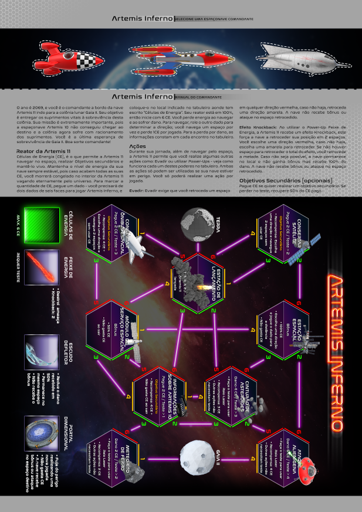

### Tipografia
A tipografia escolhida para todas as informações textuais do jogo e manual foi a [Nasalization][1], devido ao desenho dos seus caracteres - uma mescla de curvas bem definidas com uma largura quadrada e ângulos retos, consegue transmitir um tom futurista espacial.

Veja abaixo uma imagem de um modelo 3D do interior de uma espaçonave. Perceba como a mescla de curvas e ângulos retos transmitem uma sensação futurista espacial.

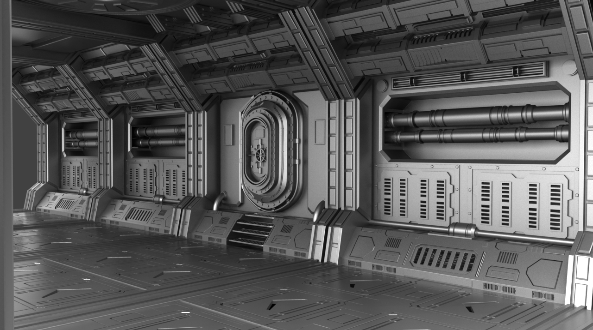

*Modelagem 3D realizada pelo artista digital Colin Kaszynski*

Agora veja como a tipografia Nasazilation utiliza essa mesma mescla de formas para transmitir a mesma sensação que a imagem acima.

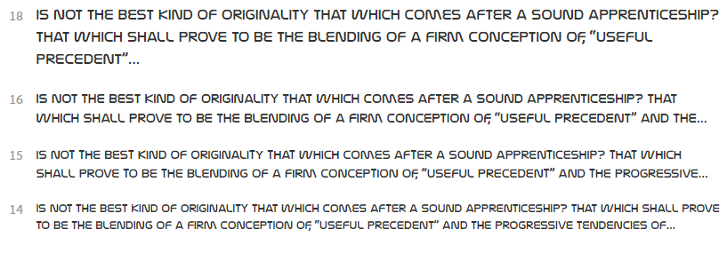

Além disso, como a área do playfield é muito reduzida, a tipografia precisava ter também uma boa legibilidade em tamanhos menores. A nasalization também supre esse requisito.

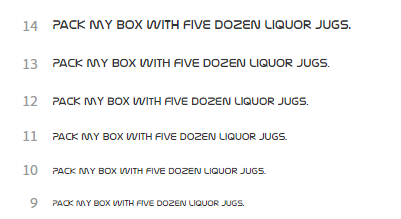

> **Nota**
>
> Para maiores informações acesse a página da tipografia Nasalization no site da Adobe Typekit: https://typekit.com/fonts/nasalization

## Level design
Artemis Inferno possui apenas um único level, constante e imutável devido a natureza de sua plataforma. Porém, como o gameplay é baseado primordialmente em navegação randômica do avatar e aliado aos espaços hexagonais, que permitem uma maior quantidade de possibilidades de direções, Artemis Inferno consegue prover experiências distintas de gameplay.

O level foi projetado de maneira a permitir duas rotas de chegada ao objetivo principal, sendo um caminho difícil e outro fácil; isso em relação ao que diz respeito aos encontros com inimigos, obstáculos, bônus e quests (objetivos secundários).

O jogo inicia a partir do espaço *Estação de Lançamento*, e a partir deste, o caminho superior é o difícil e o inferior o mais fácil. Porém o jogador irá experimentar sempre um pouco de cada caminho, devido a natureza da navegação randômica. Entretanto, se o jogador conseguir as recompensas que lhe permitem ter um controle momentâneo da direção, ele poderá tendenciar para um determinado caminho. Mas não por muito tempo!

Em Artemis Inferno não existe um caminho linear, este é um jogo de trilha não-linear. O jogador irá vivenciar um experiência de vai e volta na trilha na maior parte do tempo do gameplay. O level foi especialmente projetado para possibilitar inúmeros caminhos possíveis.

### Balanceamento de dificuldade
A dificuldade de cada um dos dois caminhos no level de Artemis Inferno, foi balanceado através da distribuição dos inimigos, obstáculos, bônus e quests, em relação ao grau de dificuldade e recompensa de cada um destes.

#### Caminho difícil
No caminho superior ou difícil, o jogador irá encontrar: uma quest, um bônus, um obstáculo e um inimigo. Sendo que estes são respectivamente:

- **Consertar Satélite:** a segunda melhor quest do jogo.
- **Estação Espacial:** o melhor encontro de bônus do jogo.
- **Cinturão de Asteróids:** o obstáculo de maior dano e difilcudade do jogo.
- **Ataque Alienígena:** o inimigo mais letal do jogo, na verdade o único inimigo do jogo.

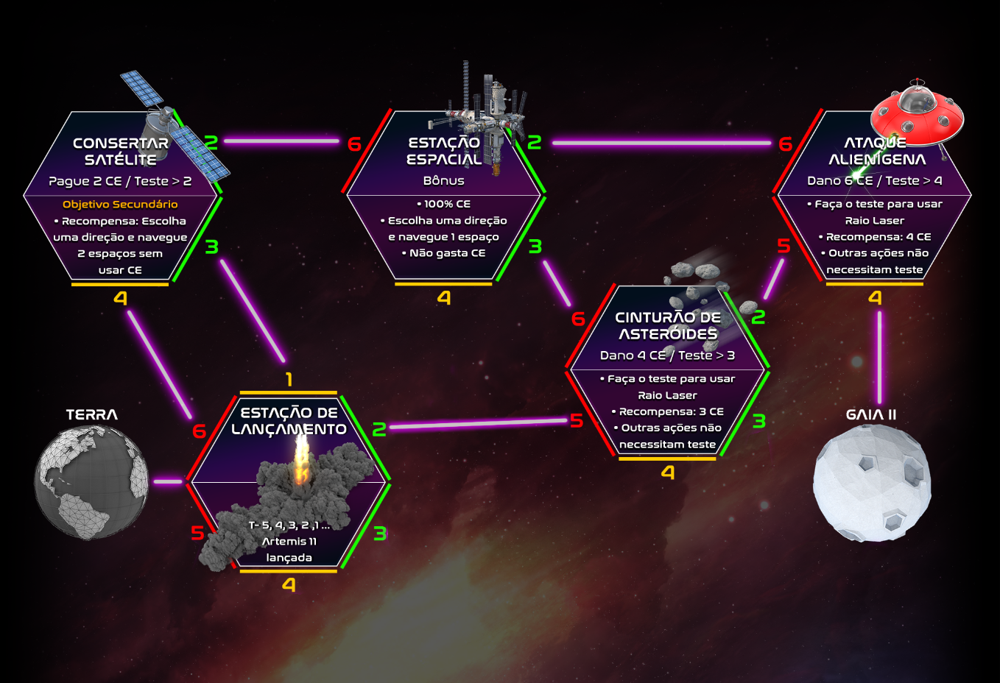

Neste caminho o sistema de tensão tenta o jogador a ir direto para o encontro Ataque Alienígena, e isso é feito através da quest Consertar Satélite e do encontro bônus Estação Espacial. O objetivo deste caminho é fazer com que o jogador decida por tentar chegar o mais próximo da conclusão do objetivo principal, porém ele é levado consequentemente ao encontro mais letal do jogo.

Além disso tem o balanceamento baseado na probabilidade, pois chegar até o encontro Ataque Alienígena e vencê-lo, não significa vitória garantida. O jogador ainda dependerá da sorte para conseguir chegar ao objetivo, Gaia II. A probabilidade da próxima jogada levar o jogador até o objetivo principal é de aproximadamente 16,67%, no que resta 83,33% de chance de não conseguir. Na verdade essa probabilidade serve para a chegada por ambos os caminhos.

#### Caminho fácil
No caminho inferior ou fácil, o jogador irá encontrar: duas quests, um bônus e um obstáculo. Sendo que estes são respectivamente:

- **Consertar Ônibus Espacial:** a melhor quest do jogo.
- **Informações sobre Artemis 10:** a quest mais fácil do jogo e que concede uma recarga total de CE.
- **Módulo de Serviço Espacial:** um bônus que concede recarga de 50% de CE.
- **Meteoríto de Ferro:** o obstáculo mais fácil do jogo

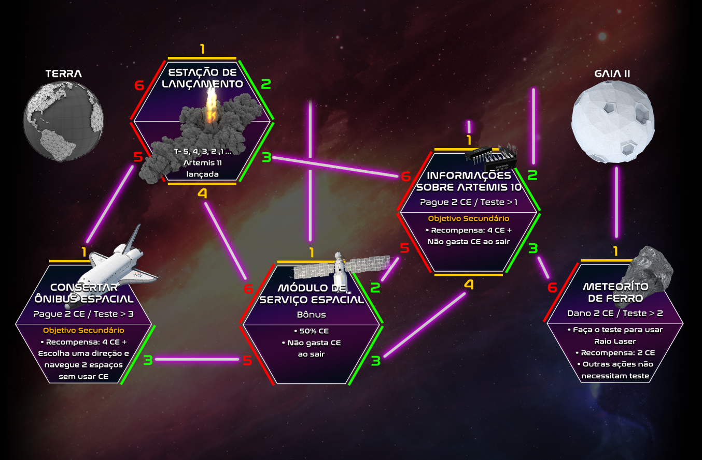

Neste caminho o sistema de tensão não força o jogador até o encontro Meteoríto de Ferro, mesmo este possuindo a mesma a probabilidade do caminho superior em relação a chegada em Gaia II - 16,67%. O sistema de tensão através da quest  Consertar ônibus Espacial, tende a forçar o jogador mais ao centro da trilha ou até mesmo ao caminho superior, que a primeira vista parece ser o mais rápido para concluir o jogo.

O caminho inferior é mais voltado a regeneração das CE's.

#### Probabilidade de conclusão
Como informado anteriormente, independente do caminho, o level do jogo foi balanceado de modo a permitir que a probabilidade de conclusão do jogo seja a mesma, ou seja, 16,67% de chance para alcançar Gaia II.

---

## Regras para o jogador
Esta seção contém o manual de regras contido no jogo Artemis Inferno.

### Artemis Inferno | Manual do comandante
O ano é 2069, e você é o comandante a bordo da nave Artemis 11 indo para a colônia lunar Gaia II. Seu objetivo é entregar os suprimentos vitais à sobreviência desta colônia. Sua missão é extremamente importante, pois a espaçonave Artemis 10 não conseguiu chegar ao destino e a colônia agora sofre com racionamento dos suprimentos. Você é a última esperança de sobrevivência de Gaia II. Boa sorte comandante!

#### Reator da Artemis 11
Células de Energia (CE), é o que permite a Artemis 11 navegar no espaço, realizar Objetivos secundários (opcionais) e mantê-lo vivo. Mantenha o nível de energia da sua nave sempre estável, pois caso acabem todas as suas CE, você morrerá congelado no interior da Artemis 11 vagando eternamente pelo universo. Para marcar a quantidade de CE, pegue um dado - você precisará de dois dados de seis faces para jogar Artemis Inferno, e coloque-o no local indicado no tabuleiro aonde tem escrito "Células de Energia". Seu reator está em 100%, então inicie com 6 CE. Você perde energia ao navegar e ao sofrer dano. Para navegar, role o outro dado para determinar a direção; você navega um espaço por vez e perde 1CE por jogada. Para a perda por dano, as informações constam em cada encontro no tabuleiro.

#### Ações
Durante sua jornada, além de navegar pelo espaço, a Artemis 11 permite que você realize algumas outras ações como: Evadir ou utilizar Power-Ups - veja como funciona cada um destes poderes no tabuleiro. Ambas as ações só podem ser utilizadas se sua nave estiver em perigo. Você só poderá realizar uma ação por jogada.

**Evadir:** Evadir exige que você retroceda um espaço em qualquer direção vermelha, caso não haja, retroceda uma direção amarela. A nave não recebe bônus ou ataque no espaço retrocedido.

**Efeito Knockback:** Ao utilizar o Power-Up Feixe de Energia, a Artemis 11 recebe um efeito Knockback, este força a nave a retroceder sua posição em 2 espaços.  Você escolhe uma direção vermelha, caso não haja, escolha uma amarela para retroceder. Se não houver espaço para retroceder o total do efeito, você retrocede a metade. Caso não seja possível, a nave permanece no local e não ganha bônus mas recebe 100% do dano. A nave não recebe bônus ou ataque no espaço retrocedido.

#### Objetivos Secundários [Opcional]
Pague CE se quiser realizar um objetivo secundário. Se perder no teste, recupere 50% do CE pago.


[1]:https://typekit.com/fonts/nasalization/details/nasalization-regular
